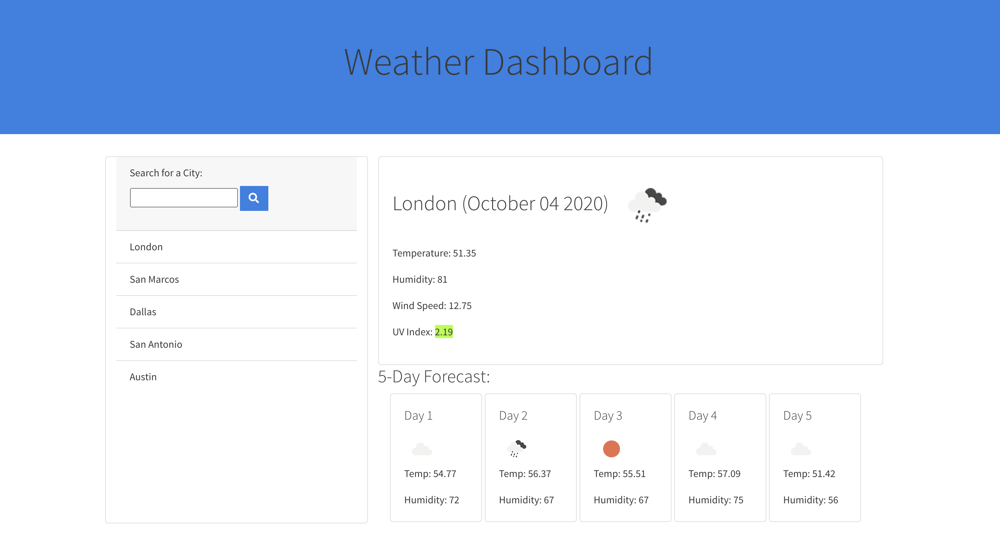

# Weather Dashboard

## Deployed

[Access the deployed web application here.](https://christinakerr.github.io/WeatherDashboard/)

## Purpose

This weather dashboard displays the current weather and 5 day forecast for any city around the world. Built to suit avid travelers, the site allows the user to quickly switch back and forth between previous searches to compare weather and plan their trips accordingly. The previous searches are saved in the browser so the user can access their favorite cities quickly when reloading or reopening the page.

## Tech

This application leverages:

* HTML
* CSS
* Bootstrap
* JavaScript
* jQuery
* OpenWeather API
* Moment.js

